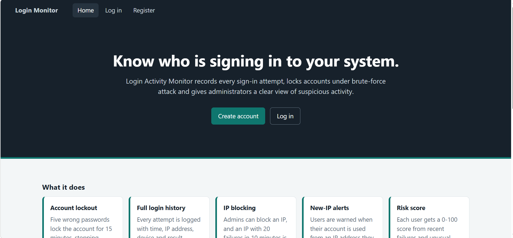
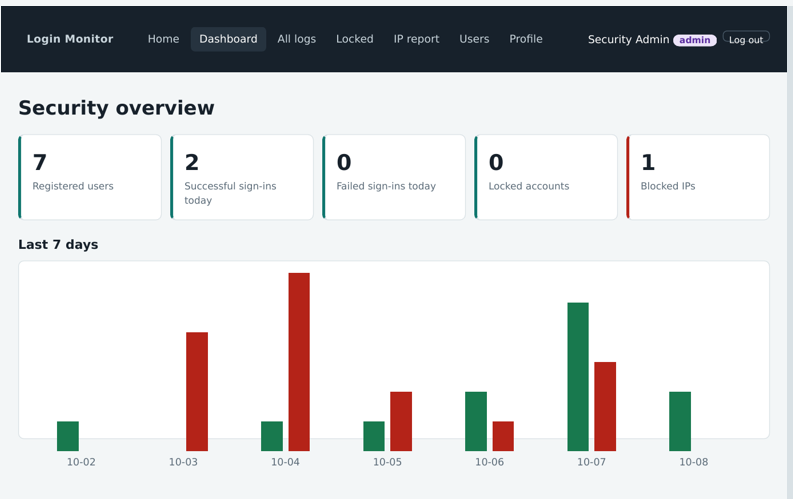

# Login Activity Monitor
A multi-page, multi-role web application that records every sign-in attempt, locks accounts under brute-force attack, and gives a security administrator a dashboard to spot suspicious activity. Built for a web development course with a focus on **defensive web security**.


## Screenshots

| Landing page | Admin dashboard |
|---|---|
|  |  |


## Features

- **Account lockout** after 5 wrong passwords (15 minute lock)
- **Full login logging** with time, IP address, device and result (`success`, `failed`, `locked`, `blocked`)
- **IP blocking**: manual by the admin, plus automatic after 20 failed logins from one IP in 10 minutes
- **New-IP alerts** when an account is used from an IP address it has not used before
- **Risk score** (0-100) for every user
- **User area**: dashboard, personal login history, profile, change password, delete account
- **Admin panel**: statistics, 7-day chart, filterable logs, locked accounts, IP report, user management
- **CRUD operations**, **search and filter**, **CSV export**
- **Responsive design** with a mobile menu

## User Roles

| Role | Permissions |
|---|---|
| **User** | Register, log in, view own dashboard and history, edit profile, change password, delete own account |
| **Security Admin** | All user features (except self-delete), plus view all logs, unlock accounts, block/unblock IPs, manage users (role, status, delete), statistics and CSV reports |

## Tech Stack

| Layer | Technology |
|---|---|
| Front-end | HTML5, CSS3, vanilla JavaScript (`fetch` API), Chart.js |
| Back-end | Node.js, Express |
| Database | SQLite via Node.js built-in `node:sqlite` |
| Security | `bcryptjs`, `express-session`, `helmet` |

No native build tools (Visual Studio, Python) are required.

## Getting Started

### Prerequisites

- [Node.js](https://nodejs.org) **22.13 or newer** (LTS recommended)

```bash
node -v
```

### Installation

```bash
# 1. Clone the repository
git clone https://github.com/YOUR-USERNAME/login-activity-monitor.git
cd login-activity-monitor

# 2. Install dependencies
npm install

# 3. Start the server
npm start
```

Open **http://localhost:3000** in your browser.

> A line like `ExperimentalWarning: SQLite is an experimental feature` in the terminal is only a notice, not an error.

### Default admin account

| Email | Password |
|---|---|
| `admin@example.com` | `Admin@123` |

The admin is created automatically on the first run. **Change this password after your first login.**

Normal users sign up on the Register page. Passwords need at least 8 characters with an uppercase letter, a lowercase letter and a number.

### Environment variables (optional)

| Variable | Default | Purpose |
|---|---|---|
| `PORT` | `3000` | Server port |
| `SESSION_SECRET` | built-in placeholder | Secret that signs session cookies. **Set your own value outside of local testing** |

```bash
# macOS / Linux
SESSION_SECRET=my-long-random-secret npm start

# Windows PowerShell
$env:SESSION_SECRET="my-long-random-secret"; npm start
```

## Pages

| URL | Access | Page |
|---|---|---|
| `/` | Public | Landing page |
| `/register` | Public | Create account |
| `/login` | Public | Log in |
| `/dashboard` | User | Last sign-in, failed attempts, new-IP warnings |
| `/history` | User | Own sign-in history |
| `/profile` | User, Admin | Edit details, statistics, risk score, delete account |
| `/change-password` | User | Change password |
| `/admin` | Admin | Statistics cards and 7-day chart |
| `/admin/logs` | Admin | All logs with filters and CSV download |
| `/admin/locked` | Admin | Locked accounts, unlock button |
| `/admin/ips` | Admin | Activity per IP, block and unblock |
| `/admin/users` | Admin | Search, filter, role, activate/deactivate, delete |

## How the Lockout Works

```
Login request
   |
   +-- IP blocked?            -> reject, log "blocked"
   +-- Unknown email?         -> generic error, log "failed"
   +-- Account locked?        -> reject, log "locked"
   +-- Wrong password?        -> failed_attempts + 1, log "failed"
   |                             5th failure -> lock for 15 minutes
   |                             20 failures from this IP in 10 min -> block IP
   +-- Correct password       -> reset counters, detect new IP, log "success", start session
```

Settings are constants at the top of `routes/auth.js`: `MAX_ATTEMPTS`, `LOCK_MINUTES`, `AUTO_BLOCK_FAILS`, `AUTO_BLOCK_WINDOW`.

## Security Features

| Feature | Implementation |
|---|---|
| Password storage | bcrypt hashing with salt |
| Authentication | Server-side sessions, `httpOnly` + `sameSite` cookie, session renewed on login, 1 hour expiry |
| Authorization | Role-based middleware on every API route and admin page. Role and active status are re-checked on each request |
| Brute-force protection | Account lockout and automatic IP blocking |
| SQL injection | Prepared statements with bound parameters |
| XSS | Output escaping and a Content-Security-Policy header (Helmet) |
| User enumeration | Same error for unknown email and wrong password, equalised timing |
| Input validation | Server-side checks for name, email and password |
| CSV injection | Formula characters are neutralised in exports |
| Sensitive actions | Password required to change email or delete an account. Admins cannot delete, demote or block themselves |
| Audit trail | Login logs are kept after a user is deleted |

## Database

SQLite file `data.db` is created automatically on first run.

| Table | Purpose | Key columns |
|---|---|---|
| `users` | Accounts | `id`, `name`, `email` (unique), `password_hash`, `role`, `failed_attempts`, `locked_until`, `is_active`, `created_at` |
| `login_logs` | Every sign-in attempt | `id`, `user_id`, `email_tried`, `ip_address`, `user_agent`, `status`, `is_new_ip`, `created_at` |
| `blocked_ips` | Blocked addresses | `id`, `ip_address` (unique), `reason`, `blocked_by`, `created_at` |

**Risk score** = `failed logins x 5 + attempts on a locked account x 3 + new-IP logins x 10` over the last 7 days, capped at 100.

## API Reference

<details>
<summary><strong>Auth</strong> (<code>/api/auth</code>)</summary>

| Method | Path | Description |
|---|---|---|
| POST | `/register` | Create account |
| POST | `/login` | Log in |
| POST | `/logout` | Log out |

</details>

<details>
<summary><strong>User</strong> (<code>/api/user</code>, login required)</summary>

| Method | Path | Description |
|---|---|---|
| GET | `/me` | Current user |
| GET | `/summary` | Dashboard data |
| GET | `/history` | Own login history |
| GET | `/profile` | Profile and statistics |
| PUT | `/profile` | Update name / email |
| POST | `/change-password` | Change password |
| DELETE | `/account` | Delete own account (users only) |

</details>

<details>
<summary><strong>Admin</strong> (<code>/api/admin</code>, admin only)</summary>

| Method | Path | Description |
|---|---|---|
| GET | `/stats` | Cards and chart data |
| GET | `/logs` | Logs. Filters: `status`, `email`, `ip`, `from`, `to`, `limit` |
| GET | `/logs.csv` | CSV export with the same filters |
| GET | `/locked` | Locked accounts |
| POST | `/unlock/:id` | Unlock an account |
| GET | `/ips` | Activity per IP and blocked list |
| POST | `/block-ip` | Block an IP |
| POST | `/unblock-ip` | Unblock an IP |
| GET | `/users` | Users with risk score. Filters: `q`, `role`, `status` |
| POST | `/users/:id/role` | Change role |
| POST | `/users/:id/active` | Activate or deactivate |
| DELETE | `/users/:id` | Delete user |

</details>

## Project Structure

```
login-activity-monitor/
├── server.js              Express app, security headers, page routes
├── database.js            SQLite connection, tables, default admin
├── utils.js               IP helper and validation rules
├── package.json
├── middleware/
│   ├── auth.js            Login check (API and pages)
│   └── role.js            Admin-only check
├── routes/
│   ├── auth.js            Register, login (lockout logic), logout
│   ├── user.js            Dashboard data, history, profile, password
│   └── admin.js           Stats, logs, locked accounts, IPs, users
├── views/                 12 HTML pages
└── public/
    ├── css/style.css      Styles and responsive rules
    └── js/                common.js + one script per page
```

## Try It Out

1. Register a new user from the landing page.
2. Log out and enter a wrong password 5 times. The account locks.
3. Log in as admin, open **Locked** and click **Unlock**.
4. Open **All logs**, filter by `failed` and download the CSV.
5. Open **Users**, search for the account and change its role or delete it.

## Troubleshooting

| Problem | Solution |
|---|---|
| `node is not recognized` | Install Node.js and restart the terminal / VS Code |
| `Cannot find module 'express'` | Run `npm install` in the folder that contains `package.json` |
| `EADDRINUSE: port 3000` | Another process is using the port. Stop it, or run with `PORT=3001` |
| Blocked from your own IP while testing | Stop the server, delete `data.db`, start again |
| Chart does not appear | Chart.js loads from a CDN, so an internet connection is needed |
| Want a clean database | Stop the server and delete `data.db` |

## Disclaimer

This project is built for learning and demonstration. Before using any part of it in production, add HTTPS, a persistent session store, rate limiting at the network level, CSRF tokens, and replace the default admin credentials and session secret.

## License

Released under the [MIT License](LICENSE).

## Author

**Jannatul Mawa Mona** 

[GitHub](https://github.com/jannatulmona)
